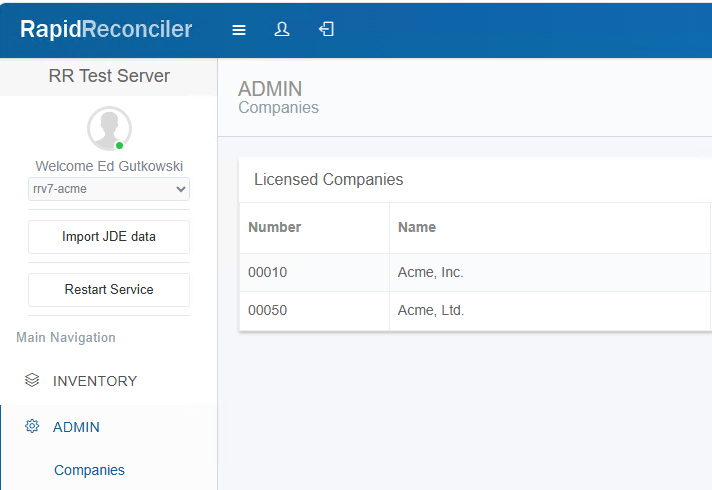

# Adding a Company License to RapidReconciler

## Overview

Company numbers in RapidReconciler are license-controlled and can only be added by GSI staff. Each company displayed in the application corresponds to a licensed JD Edwards company number as specified in your purchase agreement.

---

## Requesting Additional Companies

If you have additional companies you would like to reconcile that are not currently available in the application, please contact GSI support to begin the licensing process.

**Email:** [rrsupport@getgsi.com](mailto:rrsupport@getgsi.com)

Please include the following information in your request:

- Your company name and RapidReconciler account details
- The JD Edwards company numbers you would like to add
- The corresponding company names

A GSI representative will follow up to confirm licensing and coordinate the update.

---

## Managing Company Settings

Company settings, including enabling or disabling companies for individual users, are managed by your RapidReconciler administrator. If you need changes to your company configuration, please contact your internal RapidReconciler administrator.

---

> **Note:** Changes to company licensing may require a restart of the RapidReconciler Agent before they take effect in the application.
