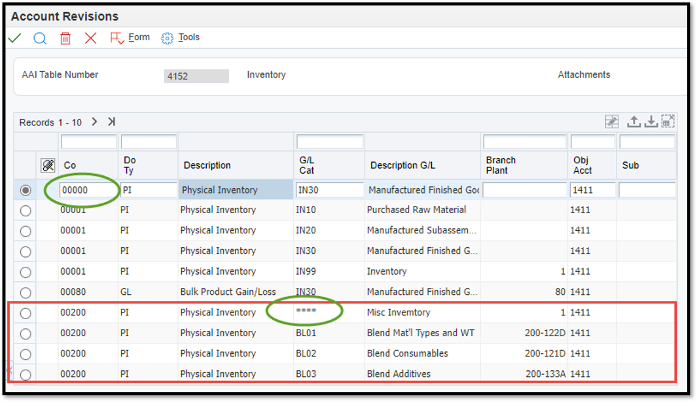
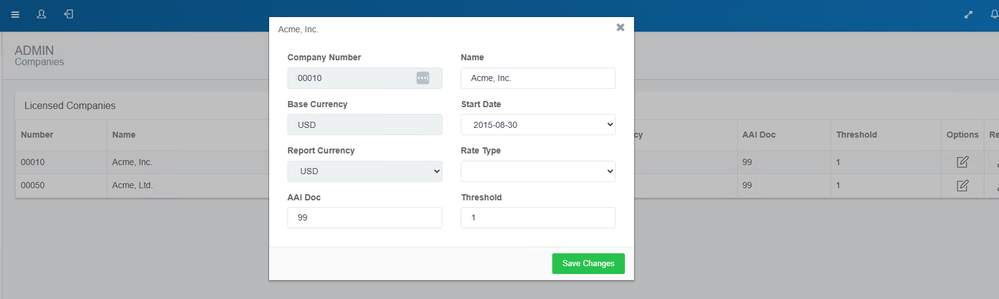
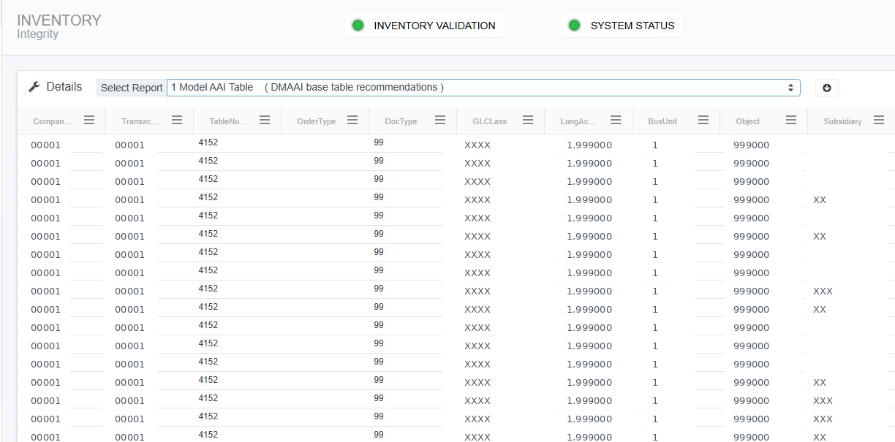
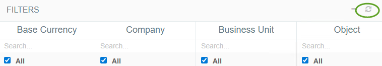

# RapidReconciler Inventory Account Management

## Topic: Inventory Accounts and JD Edwards DMAAI Configuration

---

## Table of Contents

- [Overview](#overview)
- [Section 1: DMAAI Configuration in JD Edwards](#section-1-dmaai-configuration-in-jd-edwards)
- [Section 2: How to Add an Inventory Account](#section-2-how-to-add-an-inventory-account)
- [Section 3: Troubleshooting](#section-3-troubleshooting)
- [Section 4: Quick Reference](#section-4-quick-reference)

---

## Overview

Inventory accounts in RapidReconciler are sourced directly from the **DMAAI model table in JD Edwards**. This is the only JD Edwards configuration required for RapidReconciler to function. Accounts cannot be added directly within the RapidReconciler application -- all additions and changes must be made in JD Edwards, after which RapidReconciler picks them up during the next scheduled refresh cycle.

RapidReconciler uses **DMAAI table 4152** with document type **PI** as the default to determine which inventory accounts are displayed in the application.

> **Note:** The default document type of PI may have been changed for your organization. Check with your RapidReconciler administrator to confirm the correct document type before proceeding.

---

## Section 1: DMAAI Configuration in JD Edwards

### 1.1 How RapidReconciler Uses DMAAI

The DMAAI (Default Model AAI) table in JD Edwards defines the general ledger accounts associated with inventory transactions by GL class code. RapidReconciler reads these entries to determine which accounts to display in the reconciliation interface.

| Setting | Default Value |
|---|---|
| DMAAI Table | 4152 |
| Document Type | PI |

### 1.2 Changing the Default Document Type

The default document type (PI) may be changed by the RapidReconciler administrator in the company settings. If a different document type is configured, additional DMAAI entries must be set up in JD Edwards for that document type in order for the correct accounts to appear in RapidReconciler.

> **Important:** Setting up and maintaining DMAAI entries in JD Edwards is the responsibility of the customer. RapidReconciler displays accounts based on whatever entries exist in the configured DMAAI table and document type -- the customer is responsible for vetting the accuracy of these entries.

### 1.3 Summary of Setup Requirements

DMAAI table 4152 with the appropriate document type is the **only JD Edwards configuration required** for RapidReconciler. No other JDE setup is needed for the application to function.

---

## Section 2: How to Add an Inventory Account

### 2.1 Step-by-Step Procedure

Follow these steps to add a new inventory account in RapidReconciler:

1. **Log in to JD Edwards.**
2. **Navigate to the DMAAI screen** (Account Revisions).
3. **Inquire on table 4152**, filtering on your model document type (typically PI).
4. **Create a new entry** using the following fields:

| Field | Description |
|---|---|
| **Company Number** | The company number associated with the new account |
| **GL Class Code** | The GL class code for the inventory items to be associated with this account |
| **Business Unit** | The business unit component of the account number |
| **Object Account** | The object account component of the account number |
| **Subsidiary** | The subsidiary component of the account number, if applicable |

> **Tip:** If you are unsure which GL class code to use, refer to your JD Edwards item master records or consult your JD Edwards administrator. The GL class code on the DMAAI entry must match the GL class code assigned to the inventory items you want to reconcile.

Use Integrity report 1 shown below to validate that the new DMAAI entry is set up correctly and will be picked up by RapidReconciler:

### 2.2 Additional Requirements

In addition to creating the DMAAI entry, the following conditions must be met before the new account will appear in RapidReconciler:

- **Inventory transaction activity must exist** -- There must be at least one inventory transaction for an item with the associated GL class code. The account will not appear in the filter list without transaction activity.
- **A RapidReconciler refresh cycle must complete** -- The nightly import job must complete at least one full cycle after the DMAAI entry has been created and transaction activity exists.
- **Manual refresh if needed** -- If the account still does not appear after the refresh cycle has completed, click the **refresh icon** in the top right corner of the account filters on the RapidReconciler reconciliation page to force the filter list to reload.

> **Note:** If the account still does not appear after completing all of the above steps, verify that the DMAAI entry was saved correctly in JD Edwards and that the GL class code matches the items with transaction activity. Contact your RapidReconciler administrator if the issue persists.

---

## Section 3: Troubleshooting

| Symptom | Likely Cause | Action |
|---|---|---|
| New account not appearing after refresh | No transaction activity for the GL class code | Confirm at least one inventory transaction exists for an item with the matching GL class code |
| New account not appearing after transactions exist | Refresh cycle has not yet run | Wait for the nightly import job to complete and check again |
| Account filter list appears stale | Cached filter data | Click the **refresh icon** in the top right corner of the account filters |
| Wrong accounts appearing | Incorrect document type configured | Check with your RapidReconciler administrator to confirm the document type in company settings |
| DMAAI entry saved but account missing | Entry may reference wrong table or document type | Verify the entry is in table 4152 under the correct document type |

---

## Section 4: Quick Reference

| Item | Detail |
|---|---|
| Default DMAAI table | 4152 |
| Default document type | PI |
| Where to add accounts | JD Edwards DMAAI screen (Account Revisions) |
| When accounts appear in RapidReconciler | After the next completed nightly refresh cycle |
| Who is responsible for DMAAI accuracy | The customer |
| Only JD Edwards setup required | DMAAI table 4152 with the configured document type |