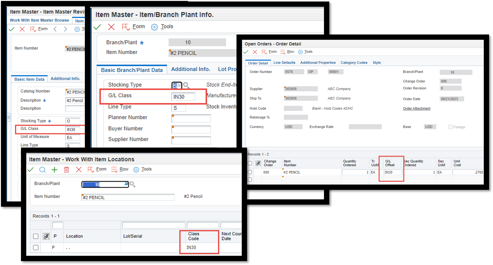
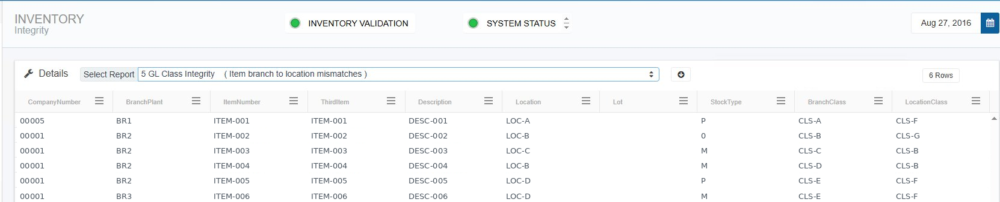

# GL Class Code Management and Change Procedures

## Table of Contents

- [Overview](#overview)
- [Section 1: The GL Class Code Hierarchy](#section-1-the-gl-class-code-hierarchy)
- [Section 2: How GL Class Codes Are Used in Transactions](#section-2-how-gl-class-codes-are-used-in-transactions)
- [Section 3: The Risk of Changing GL Class Codes with Quantity on Hand](#section-3-the-risk-of-changing-gl-class-codes-with-quantity-on-hand)
- [Section 4: Procedure for Changing a GL Class Code](#section-4-procedure-for-changing-a-gl-class-code)
- [Section 5: Inventory Integrity Report 5](#section-5-inventory-integrity-report-5)
- [Section 6: Organizational Best Practices](#section-6-organizational-best-practices)
- [Section 7: Quick Reference Summary](#section-7-quick-reference-summary)
- [Section 8: Related Documentation](#section-8-related-documentation)

---

## Overview

GL Class Codes are 4-character item attributes assigned in JD Edwards that determine how inventory transactions are recorded in the General Ledger. The mapping between GL Class Codes and journal entries is defined in the Distribution/Manufacturing Automatic Accounting Instructions (DMAAIs).

This document covers:

- The GL Class Code hierarchy
- How GL Class Codes are used in transactions
- The correct procedure for changing a GL Class Code
- Integrity Report 5
- Common mistakes and how to avoid them

### How RapidReconciler Helps

GL Class Code issues are among the most common and difficult-to-detect causes of inventory reconciliation variances. Because JD Edwards allows class code changes without checking for quantity on hand -- and because changes do not cascade automatically through the hierarchy -- mismatches can persist silently for extended periods before surfacing as unexplained GL discrepancies.

Without a dedicated tool, identifying GL class code problems requires manually reviewing item master, item branch, and item location records and cross-referencing them against open order lines -- a process that is impractical to perform routinely across a large item population.

RapidReconciler addresses this in two ways:

| RapidReconciler Feature | How It Helps with GL Class Codes |
|---|---|
| **Integrity Report 5 -- GL Class Integrity** | Automatically compares the GL class code on the Item Branch record (F4102) to the GL class code on every associated Item Location record (F41021). Any mismatch is listed immediately, regardless of item population size. This report should be reviewed monthly and after every GL class code change. |
| **Integrity Report 3 -- Excluded GL Classes** | Identifies items whose GL class code is not present in the model DMAAI table (4152). Items with missing GL class codes are excluded from the reconciliation entirely -- their inventory value is not counted. This catches situations where a class code change introduced a new GL class that was never added to the model table. |
| **As-Of Page** | When a GL class code is changed without following the correct adjustment procedure, the item will appear with multiple rows on the As-Of page -- one for each GL class code that has been used. This is a direct visual indicator that a mid-change procedure error occurred, and it pinpoints exactly which item and account is affected. |
| **Transaction Detail -- Section 6** | When drilling into an unreconciled transaction on the Transactions page, Section 6 lists all DMAAI entries for the GL class codes in that transaction. If a class code change caused a transaction to post to the wrong account, this section identifies exactly which AAI and class code was responsible. |

> **Key principle:** RapidReconciler does not correct GL class code issues -- all corrections must be made in JD Edwards. RapidReconciler's role is to surface the problem quickly and precisely, so the correct adjustment procedure (adjust out, change code, adjust back in) can be applied before the discrepancy compounds across multiple periods.

---

## Section 1: The GL Class Code Hierarchy

GL Class Codes exist at four levels in JD Edwards. Understanding this hierarchy is essential for maintaining accurate and consistent accounting records.

### Level 1 -- Item Master

The GL Class Code is first assigned when a new item is created in the Item Master. This is the foundation of the hierarchy and the starting point for all subsequent levels.

### Level 2 -- Item Branch

When branch plant records are created for an item, the GL Class Code is copied from the Item Master to each branch plant record. While each branch plant may technically carry a different value, this is uncommon and generally not recommended.

### Level 3 -- Item Location

Each branch plant must have at least one primary location assigned to an item before any transactions can be processed. Additional secondary locations may also be defined. When locations are created, the GL Class Code is copied from the Item Branch record. Different values per location are possible but uncommon.

### Level 4 -- Sales Order / Purchase Order

When a purchase order or sales order is entered, the GL Class Code is copied from the item's location record to each order line via the **Additional Info** form.

> **Key Takeaway:** The GL Class Code flows downward through the hierarchy -- from Item Master to Item Branch to Item Location to Order Line -- but it does **not** update automatically. Each level must be maintained independently.

---

## Section 2: How GL Class Codes Are Used in Transactions

Different transaction types retrieve the GL Class Code from different levels of the hierarchy:

| Transaction Type | GL Class Code Source | Timing |
|---|---|---|
| Work Orders (material issues and completions) | Item Branch level | Batch -- during manufacturing accounting (R31802) |
| Sales Orders and Purchase Orders (shipments and receipts) | Order line level | Real time |
| Inventory Transactions (issues, adjustments, transfers, cycle counts) | Item Location level | Real time |

> **Important:** Because different transaction types pull the GL Class Code from different levels, the code must be **consistent across all levels** for a given item. If values differ, the same item could post to different GL accounts depending on the transaction type -- creating inconsistencies in financial reporting and inventory valuation.

---

## Section 3: The Risk of Changing GL Class Codes with Quantity on Hand

JD Edwards allows changes to GL Class Code fields at any level of the hierarchy **without checking whether there is quantity on hand for the item**. This presents a significant accounting risk.

> **Critical Rule:** GL Class Codes should only be changed when the quantity on hand for the item is **zero**. Changing a GL Class Code while quantity exists in inventory will cause account discrepancies that surface as reconciling items at period end.

### What Goes Wrong -- Incorrect Process

The following example illustrates what happens when a GL Class Code is changed while quantity is still on hand.

**Scenario:** An item was misclassified as a finished good and needed to be reclassified as a raw material. A receipt of $100 had already occurred before the change was made.

| Step | Transaction | Account Debited | Account Credited |
|---|---|---|---|
| 1 | Receipt (OV) of $100 | Finished Goods | RNV |
| 2 | GL Class Code changed to Raw Materials (quantity still on hand) | -- | -- |
| 3 | Material issue (IM) | WIP | **Raw Materials** |

**Result:** The Finished Goods account still carries the $100 receipt with no corresponding relief. The Raw Materials account was credited on the issue even though it was never debited. An account discrepancy exists that will surface as a reconciling item at period end.

### What Happens Correctly -- Correct Process

The following example shows the same reclassification handled properly.

| Step | Transaction | Account Debited | Account Credited |
|---|---|---|---|
| 1 | Receipt (OV) of $100 | Finished Goods | RNV |
| 2 | Inventory adjustment (IA) to zero out quantity | -- | **Finished Goods** |
| 3 | GL Class Code changed to Raw Materials (quantity now at zero) | -- | -- |
| 4 | Inventory adjustment (IA) to re-establish quantity | **Raw Materials** | -- |
| 5 | Material issue (IM) | WIP | **Raw Materials** |

**Result:** All accounts reflect the correct balances with no discrepancies.

---

## Section 4: Procedure for Changing a GL Class Code

Follow this procedure any time a GL Class Code change is required for an item that is or has been in inventory.

### Step 1 -- Verify Quantity on Hand

- Confirm the current on-hand balance for the item across **all locations and lots**.
- Check for quantity in transit or on open orders that may also need to be addressed.
- If quantity on hand is already zero, proceed to Step 3.

### Step 2 -- Adjust Inventory to Zero

- Perform an **inventory adjustment (IA)** to issue out all quantity on hand.
- This ensures the current GL account is properly relieved before the code is changed.
- Document the adjustment with a clear remark referencing the GL Class Code change for audit purposes.

> **Note:** If the item exists across multiple locations or lots, each must be adjusted individually. Do not proceed to the next step until all locations show zero on-hand quantity.

### Step 3 -- Update the GL Class Code at All Levels

Update the GL Class Code at **every applicable level** in the following order:

1. **Item Master** (F4101)
2. **Item Branch** for each applicable branch plant (F4102)
3. **Item Location** for each applicable location (F41021)
4. **Open Sales Order lines** -- update via the Additional Info form on each open line
5. **Open Purchase Order lines** -- update via the Additional Info form on each open line

> **Important:** Changes do not cascade. Updating the Item Master does not automatically update Item Branch, Item Location, or open order lines. Each level must be updated manually.

### Step 4 -- Adjust Inventory Back In

- Perform a second **inventory adjustment (IA)** to re-establish the on-hand quantity under the new GL Class Code.
- This ensures the correct GL account is debited for the inventory value.
- Document this adjustment with the same reference as Step 2 for a complete audit trail.

### Step 5 -- Verify Account Balances

- Confirm that the **old account** has been fully relieved.
- Confirm that the **new account** reflects the correct balance.
- Run **Integrity Report 5** (see Section 5) to verify that GL Class Codes are now consistent across Item Branch and Item Location records.

---

## Section 5: Inventory Integrity Report 5

**Integrity Report 5** identifies items where the GL Class Code at the Item Branch level does not match the GL Class Code on one or more of its corresponding Item Location records.

Since these values are expected to be the same, any item appearing on this report should be reviewed promptly and corrected in JD Edwards before the discrepancy affects transaction accuracy.

> **Best Practice:** Run Integrity Report 5 regularly -- particularly after any GL Class Code change -- to proactively identify and resolve mismatches before they cause incorrect journal entries or period-end reconciliation issues.

Integrity Report 5 can be accessed via the RapidReconciler application under the Inventory Integrity Reports menu. Review the report output for any items listed and take corrective action as needed to ensure GL Class Codes are consistent across all levels of the hierarchy.

## Section 6: Organizational Best Practices

### Establish a Formal Change Procedure

Establish a formal procedure within your organization that requires on-hand quantity to be at zero before any GL Class Code change is processed. This discipline prevents significant reconciliation issues at month end.

Consider requiring the following approvals before a GL Class Code change is processed:

- Review by the cost accountant or inventory accountant
- Confirmation that all on-hand quantity has been adjusted to zero
- Sign-off that all hierarchy levels have been updated

### Keep GL Class Codes Consistent Across All Levels

GL Class Codes should always be the same across all levels for a given item. Run Integrity Report 5 regularly to identify and correct any mismatches.

### Document All Changes

Document GL Class Code changes with clear remarks on the adjustment transactions and maintain a log of changes for audit purposes. Include:

- The item number and description
- The old and new GL Class Code
- The reason for the change
- The date and who processed the change
- The adjustment transaction document numbers

### Timing of Changes

Where possible, schedule GL Class Code changes during periods of low inventory activity -- ideally when on-hand quantity is naturally at zero -- to minimize the number of adjustment transactions required and reduce the risk of timing errors.

---

## Section 7: Quick Reference Summary

| Topic | Key Point |
|---|---|
| GL Class Code hierarchy | Item Master > Item Branch > Item Location > Order Line |
| Automatic cascade | Changes do **not** cascade -- each level must be updated manually |
| When to change | Only when quantity on hand is **zero** across all locations and lots |
| Adjustment process | Adjust out, change code at all levels, adjust back in |
| Open orders | Update GL Class Code on all open sales and purchase order lines |
| Verification | Run Integrity Report 5 after every GL Class Code change |
| Audit trail | Document all adjustments with clear remarks referencing the change |
| Timing | Schedule changes during periods of low or zero inventory activity |

---

## Section 8: Related Documentation

- [DMAAI Reference Guide](../MDS/dmaai-reference-guide.md)
- [Account Management -- Adding an Inventory Account](../MDS/add-account-rr.md)