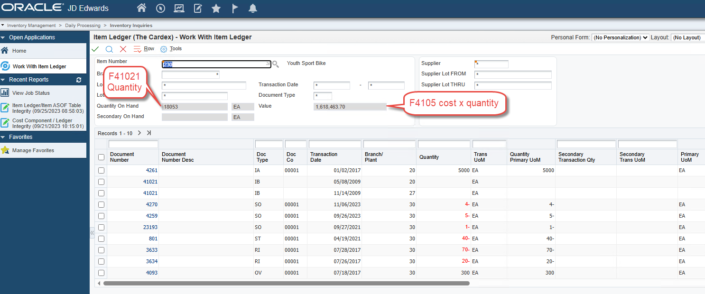

# JD Edwards Item Ledger (Cardex) Reference Guide

## Table F4111 -- Transaction History, Analysis, and Common Errors

---

## Table of Contents

- [Overview](#overview)
- [Section 1: F4111 Table Structure and Key Fields](#section-1-f4111-table-structure-and-key-fields)
  - [1.5 Key Field Reference](#15-key-field-reference)
  - [1.6 Why the F41112 Item ASOF Table is Unreliable](#16-why-the-f41112-item-asof-table-is-unreliable)
  - [1.7 Joining F4111 to Other Tables](#17-joining-f4111-to-other-tables)
- [Section 2: Should the Item Ledger Sum Equal the Item Balance Table?](#section-2-should-the-item-ledger-sum-equal-the-item-balance-table)
- [Section 3: How to Correctly Analyze the Cardex](#section-3-how-to-correctly-analyze-the-cardex)
- [Section 4: Real-World Example -- Weighted Average Cost Calculation Error](#section-4-real-world-example----weighted-average-cost-calculation-error)
- [Section 5: Global Item Update -- A Critical Warning](#section-5-global-item-update----a-critical-warning)
- [Section 6: Best Practices for Item Ledger Integrity](#section-6-best-practices-for-item-ledger-integrity)
- [Section 7: How RapidReconciler Helps](#section-7-how-rapidreconciler-helps)
- [Section 8: Related Documentation](#section-8-related-documentation)

---

## Overview

The JD Edwards item ledger -- table F4111, commonly referred to as "The Cardex" -- contains the complete transaction history for items in the inventory system. All transactions that impact an item's quantity on hand are recorded in this table, including receipts, transfers, sales shipments, material issues, completions, and more.

Understanding how to read, analyze, and validate the item ledger is essential for accurate inventory reconciliation. Errors made during cardex analysis are a common source of false variances -- issues that appear to be data integrity problems but are actually the result of incorrect analysis technique.

This guide covers:

- The structure and key fields of the F4111 table
- A field-level reference for the most important columns analysts work with
- Why the F41112 (Item ASOF) table cannot be trusted as a standalone source for inventory balances
- Common questions about item ledger behavior
- Identifying and correcting quantity integrity variances using R41544 and R41995
- The Global Item Update creation date override risk and how to protect against it
- How to correctly analyze the cardex and avoid the three most common analyst errors
- A real-world example of a weighted average cost error identified through cardex analysis
- Best practices for maintaining item ledger integrity

---

## Section 1: F4111 Table Structure and Key Fields

### 1.1 What the Item Ledger Contains

The item ledger stores **transactional data only** -- it does not store running balances. To obtain the total on-hand quantity from this table, all qualifying transactions must be summarized. The actual on-hand balance for each item is stored in table **F41021** -- the Item Location table.

The balances displayed at the top of the item ledger screen are fetched from the following tables:

| Table | Contents |
|---|---|
| **F41021** | Item Location table -- quantity on hand |
| **F4105** | Item Cost table -- unit cost |

### 1.2 Posting Codes (ILIPCD)

The posting code in F4111 is stored in column **ILIPCD**. This field is not displayed by default on the item ledger grid but can be viewed using the JD Edwards **data browser** feature. There are four possible values:

| Posting Code | Description |
|---|---|
| **Blank** | The initial value assigned to all qualifying transactions. Also used for IB transactions created when an item is added to the system. |
| **Y** | Posted by the Item Ledger As-Of Record Generation program (R41542) to the Item ASOF file (F41112). See Section 1.6 for why F41112 should not be used as a standalone source for balances. |
| **S** | The value of inventory has not yet been impacted by the transaction. Examples include a ship confirmation transaction before running Sales Update, or an IM document type before Manufacturing Accounting has been run. |
| **X** | The transaction involved a movement of inventory only and had no effect on the general ledger. Examples include an IZ transaction created on a change of lot status. These transactions must be **excluded** when summarizing item ledger totals. |

> **Critical:** Transactions with a posting code of **"X"** must always be excluded from any cardex analysis. Including them will produce an incorrect total that does not match the on-hand balance.

### 1.3 Date Fields

There are two date fields in the item ledger to consider when determining when a transaction entered the system:

| Date Field | Description | Reliability |
|---|---|---|
| **Transaction Date** | The date typically associated with when the transaction occurred. Available on some entry screens and can be overridden by the user. Backdating and data entry errors are both common. | Less reliable |
| **Creation Date** (ILCRDJ) | The date the transaction record was created in F4111. More reliable under normal circumstances, but can be overwritten -- see Section 1.3.1 below. | More reliable -- with exceptions |

> **Recommendation:** Use the creation date when attempting to determine when a transaction entered the system. However, there is no 100% reliable method for obtaining this information in all scenarios.

#### 1.3.1 Global Item Update and Creation Date Override

> **Warning:** The creation date in F4111 can be permanently overwritten by the Global Item Update program. Once overwritten, the original transaction entry dates cannot be recovered.

Global Item Update (P4101) is a JD Edwards feature that transfers changes made to the second item number (LITM) or third item number in the Item Master table (F4101) to all other inventory tables that contain the same information -- including the item ledger (F4111).

When Global Item Update is run following a change to the second or third item number, the program **R41803** updates matching records across all designated tables. The unintended consequence is that the **Creation Date field (ILCRDJ)** is also updated to the date the change was made -- for **every record** in the item ledger for that item, regardless of when those transactions originally occurred.

**Processing options for P4101:**

| Setting | Behavior |
|---|---|
| **Blank** | Do not transfer changes to other tables |
| **1** | Transfer changes to all applicable tables |
| **2** | Transfer changes to selected tables only (defined in UDC table 40/IC, which lists 57 tables by default including F4111) |

**Impact of creation date override:**

| Area | Impact |
|---|---|
| **Transaction dating** | Determining when a specific inventory transaction was entered becomes unreliable for all historical records on the affected item |
| **RapidReconciler period logic** | RapidReconciler uses the creation date as part of its period assignment logic for item ledger records -- overwritten dates may affect historical period assignments |
| **Audit and compliance** | In environments where transaction timestamps are required for audit or regulatory purposes, overwritten creation dates may create gaps in the audit trail |
| **History reconstruction** | Once the change is made and Global Item Update is run, it may not be possible to reconstruct an accurate transaction history for the affected items |

> **Important:** There is no "date updated" field or other reliable date field in the item ledger that can be used as an alternative once the creation date has been overwritten. The original transaction entry dates are effectively lost.

### 1.4 DMAAI Information

The item ledger table does **not** store information about which DMAAI entries were used to process a transaction. It is possible to make a reasonable assumption based on the available data points -- company number, document type, GL class code, and knowledge of JD Edwards transaction processing -- but this information cannot be retrieved directly from F4111.

> **Note:** The RapidReconciler Transaction Detail Report can provide DMAAI context by combining item ledger data with the applicable DMAAI configuration at the time of the transaction.

 Refer to [DMAAI Reference Guide](../MDS/dmaai-reference-guide.md) for more information on how DMAAI entries are determined for inventory transactions.

### 1.5 Key Field Reference

The F4111 table contains over 50 columns. The fields below are the ones most commonly used during cardex analysis, custom report development, and reconciliation work. Field names follow the standard JD Edwards convention where each column is prefixed with `IL` (the table's two-letter alias for Item Ledger).

#### 1.5.1 Item, Branch, and Location Identifiers

| Field | Description | Notes |
|---|---|---|
| **ILITM** | Short item number (numeric, system-assigned) | The internal key used in nearly all joins to other inventory tables (F4101, F4102, F41021, F4105) |
| **ILLITM** | Second item number (long item number) | The user-facing item number entered on most screens; subject to change via Global Item Update |
| **ILAITM** | Third item number | Often used for cross-references, customer item numbers, or alternate part numbers |
| **ILMCU** | Branch/Plant (Business Unit) | Always right-justified and space-padded in queries -- e.g. `'      M30'` |
| **ILLOCN** | Location within the branch | Blank for items not stored in defined locations |
| **ILLOTN** | Lot number | Blank for items not under lot control |
| **ILMMCU** | Owning branch (header business unit) | May differ from ILMCU on transfer-related transactions |

#### 1.5.2 Document Identification

| Field | Description | Notes |
|---|---|---|
| **ILDCT** | Document type (e.g. OV, IT, IM, IA, IS, IZ, IB) | Identifies what kind of transaction created the record. See Section 1.5.5 below. |
| **ILDOC** | Document number | Unique within document type and company |
| **ILKCO** | Document company | Five-character company assigned at document creation |
| **ILSFX** | Document pay item (suffix) | Distinguishes multiple lines on a single document |
| **ILDCTO** | Order document type (e.g. OP for purchase orders, SO for sales orders) | Populated when the transaction was generated from an order |
| **ILDOCO** | Order document number | The originating order number |
| **ILKCOO** | Order document company | Company of the originating order |
| **ILLNID** | Order line number | Identifies the line within the originating order |

#### 1.5.3 Quantity, Cost, and Amount Fields

These fields are stored without decimal places in the database. The decimal positions must be applied when displaying or summarizing them.

| Field | Description | Decimal Handling |
|---|---|---|
| **ILTRQT** | Transaction quantity (in transaction UOM) | Stored as integer; **divide by 1,000** to obtain actual quantity (3 implied decimal places) |
| **ILUNCS** | Unit cost at the time of the transaction | Stored as integer; **divide by 10,000** to obtain actual unit cost (4 implied decimal places) |
| **ILPAID** | Extended cost of the transaction (quantity × unit cost) | Stored as integer; **divide by 100** to obtain actual amount (2 implied decimal places) |
| **ILTRUM** | Transaction unit of measure | Two-character UOM code; must be checked before totaling quantities (see Section 3.2) |

> **Important:** When summarizing F4111 directly via SQL or a custom report, always apply the correct decimal scaling. A common error is to sum ILTRQT and ILPAID without dividing, producing totals that are 1,000× and 100× larger than expected.

#### 1.5.4 Date Fields

| Field | Description | Notes |
|---|---|---|
| **ILDGL** | General Ledger date (Julian) | The date that drives GL posting and period assignment |
| **ILTRDJ** | Transaction date (Julian) | Date the transaction occurred per the entry screen; can be backdated by users (see Section 1.3) |
| **ILCRDJ** | Creation date (Julian) | Date the record was written to F4111; the most reliable indicator of when the transaction entered the system, but can be overwritten by Global Item Update (see Section 1.3.1) |

> **Date format note:** All date fields in F4111 are stored in **Julian (CYYDDD) format** -- e.g. `124001` represents January 1, 2024. This is the JD Edwards standard date format and applies throughout the system.

#### 1.5.5 GL and Posting Fields

| Field | Description | Notes |
|---|---|---|
| **ILGLPT** | GL Class Code (also called GL Posting Category) | Determines which DMAAI entries are used to derive the GL accounts for the transaction. Critical for reconciliation -- a change to this value mid-life will cause F41112 to show split balances per GL class. |
| **ILJELN** | Journal entry line number | Used to join F4111 to the corresponding F0911 line (see Section 1.7) |
| **ILICU** | Batch number | Created when the GL batch is generated (e.g. by R31802 for IM transactions). Will be blank on F4111 records that have not yet been processed by the relevant GL update program. |
| **ILIPCD** | Posting code (Blank, Y, S, X) | See Section 1.2 for the full meaning of each value |
| **ILAID** | Account ID | The unique internal account identifier from F0901 -- not the human-readable account number |

#### 1.5.6 Common Document Types in F4111

The document type (ILDCT) tells you what kind of transaction was recorded. The following are the most frequently encountered:

| Document Type | Description | Source Application |
|---|---|---|
| **OV** | Purchase order receipt | P4312 (PO Receipts) |
| **IT** | Inventory transfer | P4113 (Transfers) |
| **IA** | Inventory adjustment | P4114 (Inventory Adjustments) |
| **IM** | Material issue (manufacturing) | Manufacturing Accounting (R31802) |
| **IC** | Manufacturing completion | Work Order Completions |
| **IS** | Sales shipment | Sales Update (R42800) |
| **IZ** | Lot status change | Lot Master maintenance |
| **IB** | Item ledger balance forward / opening balance | Created when an item is added or as part of period-end balance forward processing |

> **Note:** For IM transactions, ILDOC contains the work order number rather than a sequentially-generated document number, which is why standard joins between F4111 and F0911 on `ILDOC = GLDOC` will not work for these records. See Section 1.7 for the correct join logic.

---

### 1.6 Why the F41112 Item ASOF Table is Unreliable

The **Item ASOF table (F41112)** is a JD Edwards summary table that stores period-by-period quantity and amount buckets for each item, branch, location, and lot combination. It is built and maintained by the **Item Ledger As-Of Record Generation program (R41542)**, which reads transactions from F4111, summarizes them into period buckets, and flags the source records with posting code "Y".

The intended purpose of F41112 is to provide fast access to historical period balances without re-summarizing F4111 every time. In practice, however, F41112 has a long history of accuracy problems and **should never be used as a standalone source of truth for inventory balances or reconciliation totals**. The item ledger (F4111) -- with appropriate filtering -- is the authoritative source.

#### 1.6.1 Documented Reasons F41112 Cannot Be Trusted

| Issue | Description |
|---|---|
| **Missed transactions during R41542 processing** | The As-Of generation program is known to skip certain transactions. Possible causes include records where ILIPCD is null (often the result of records created via SQL or other non-standard paths), records where the IS document type is incorrectly written with ILIPCD = "Y" instead of "X", and intermittent skips on average cost items. Once a record is missed, the F41112 buckets for the affected period will not match F4111 unless the table is fully regenerated. |
| **Weighted average cost defects** | Oracle has acknowledged a defect (BUG 8742885) affecting R41544 integrity reporting on weighted-average-cost items. The associated downstream effect is that F41112 buckets for these items can be inaccurate even after a clean regeneration, and Oracle has classified the fix as an enhancement rather than a defect -- meaning it is not patched in the standard product. |
| **Ship-confirmed but not sales-updated transactions** | Sales orders that have been ship-confirmed but for which Sales Update (R42800) has not yet run produce F4111 records with ILIPCD = "S". R41542 bypasses these records entirely. Until Sales Update runs and the record is replaced, the F41112 totals will not reflect these shipments. |
| **Duplicate writes** | Several documented cases exist where specific transaction patterns -- including credit notes received via transportation modules -- are written to F41112 twice during As-Of processing, inflating the period buckets. |
| **Period total corruption after upgrades** | Oracle Knowledge Base document 2817306.1 documents a confirmed case where, after upgrading from JD Edwards 9.1 to 9.2, F41112 period quantities for hundreds of records were materially incorrect (one example showed -1,170 in F41112 against an actual F4111 sum of +180 for the same period). The issue could not be reproduced in a test environment, making root-cause analysis effectively impossible. |
| **Full regeneration carries operational risk** | The standard remedy for a corrupted F41112 is to re-run R41542 with the regeneration processing option set to "1". This deletes the entire F41112 table before rebuilding it. On large datasets, the deletion can fail mid-flight due to insufficient rollback segment space, leaving the table in a partially-populated state. Full regeneration on a multi-million-record cardex can take many hours and requires careful coordination. |
| **No GL detail in F41112** | F41112 contains only summarized quantity and amount buckets per period. There is no document-level detail, no GL date, no document type, and no link back to F0911. Any variance identified in F41112 cannot be traced to the underlying transactions without going back to F4111. |

#### 1.6.2 Practical Implications

The R41544 Item Balance/Ledger Integrity Report uses F41112 as part of its calculation. When F41112 is wrong, R41544 will report variances that do not actually exist in F4111 -- producing false positives that consume reconciliation time. Conversely, F41112 errors that offset each other can mask true integrity issues.

> **Recommendation:** Treat F41112 as a convenience table for period reporting only, and only after confirming that R41542 has completed cleanly for the period in question. For reconciliation work, balance integrity checks, and any analysis where accuracy matters, **summarize F4111 directly** with the appropriate ILIPCD and UOM filtering described in Section 3.

> **Note:** RapidReconciler does not rely on F41112 for any reconciliation calculation. All quantity and dollar totals are derived from F4111 directly, eliminating the F41112 reliability problem from the reconciliation process entirely.

---

### 1.7 Joining F4111 to Other Tables

Custom reports and integrity queries often require joining F4111 to related JD Edwards tables. The correct join keys depend on which table is being joined and -- in some cases -- on the document type involved.

#### 1.7.1 F4111 to F0911 (General Ledger)

The relationship between F4111 and F0911 is **one-to-many** -- a single item ledger record will typically have at least two F0911 lines (a debit and an offsetting credit), and may have more depending on how the GL accounts were configured.

| F4111 Field | F0911 Field | Notes |
|---|---|---|
| **ILKCO** | GLKCO | Document company -- always required |
| **ILDCT** | GLDCT | Document type -- always required |
| **ILDOC** | GLDOC | Document number -- works for most document types, but **not for IM (manufacturing issues)**, where ILDOC contains the work order number and GLDOC contains a generated document number from a NN bucket |
| **ILJELN** | GLJELN | Journal entry line number -- needed when matching to a specific GL line |
| **ILICU** | GLICU | Batch number -- required for accurate matching when GL batches have been summarized |

> **For IM document types:** The correct join is `ILDOC = GLSBL` (subledger) with `GLSBLT = 'W'` (subledger type W for work order). The function B0000083 is needed to convert ILDOC from numeric to the left-zero-padded string format used in GLSBL.

#### 1.7.2 F4111 to F41021 (Item Location)

The Item Location table holds the running on-hand balance that the cardex sum should match.

| F4111 Field | F41021 Field |
|---|---|
| ILITM | LIITM |
| ILMCU | LIMCU |
| ILLOCN | LILOCN |
| ILLOTN | LILOTN |

The on-hand quantity in F41021 is **LIPQOH** (Primary Quantity On Hand), expressed in the item's primary unit of measure.

#### 1.7.3 F4111 to F4105 (Item Cost)

F4105 stores the current unit cost by cost method. There is no direct one-to-one relationship to a single F4111 record; F4105 reflects the *current* cost rather than the cost at the time of any historical transaction. The historical unit cost for a transaction is captured in F4111.ILUNCS at the moment the transaction was written.

| F4111 Field | F4105 Field |
|---|---|
| ILITM | COITM |
| ILMCU | COMCU |
| ILLOCN | COLOCN |
| ILLOTN | COLOTN |

The cost method on F4105 (COCMTH) determines whether the cost is standard, weighted average, last-in, or another method. For weighted average items, F4105.COUNCS is the running weighted average cost, which should agree with the implied cost calculated from on-hand quantity and inventory value.

#### 1.7.4 F4111 to F43121 (PO Receiver)

For OV (purchase receipt) document types, F43121 contains the receiver detail and should reconcile back to F4111.

| F4111 Field | F43121 Field |
|---|---|
| ILDOC | PRDOC |
| ILDCT | PRDCT |
| ILDOCO | PRDOCO |
| ILDCTO | PRDCTO |
| ILLNID | PRLNID |
| ILKCOO | PRKCOO |

The amount on the receiver (PRAREC) should equal the extended amount on the corresponding cardex record (ILPAID). A discrepancy between these two values is a common source of three-way-match variances.

---

## Section 2: Should the Item Ledger Sum Equal the Item Balance Table?

**Yes** -- with the following conditions all being met:

- All transactions with a posting code of **"X"** have been removed from the calculation.
- The transaction quantity is expressed in the item's **current primary unit of measure**.
- The item ledger table has not been purged without leaving a **balance forward record** to maintain continuity.
- No item **conversion factors** have been removed from the system.
- Any changes to an item's **primary unit of measure** were performed using the recommended procedures.

If any of these conditions are not met, a discrepancy between the item ledger summary and the item balance table may exist that is not indicative of a true inventory integrity issue, but rather a data management consideration.

### 2.1 Item Balance / Ledger Integrity Report (R41544)

The **Item Balance / Ledger Integrity Report (R41544)** is the JD Edwards tool used to identify integrity variances between the Quantity On-Hand in the Item Location table (F41021) and the Item Ledger (F4111).

In many cases, the cause of these variances can only be attributed to corrupted data in the Item Location Quantity On-Hand field (F41021.PQOH), which is a running balance of all transactions added to and subtracted from an inventory location and/or lot. Since all transaction details are written to the Item Ledger (F4111) while the Item Balance Quantity On-Hand is a running total of all transactions done to date, **the Item Ledger (F4111) is assumed to be the source of truth.**
The RapidReconciler cardex variance report is built on this same principle -- the item ledger is the source of truth for quantity, and any variance with the general ledger is a reconciling item that requires investigation.

Partial updates or corrupted data may occur because of an unpredictable event that terminates the application prematurely. In most cases it is not possible to explain how data was corrupted after the fact.

### 2.2 Repost -- Update On-Hand Inventory (R41995)

The **Repost -- Update On-Hand Inventory report (R41995)** was introduced to resolve quantity discrepancies between F41021 and F4111 without requiring direct SQL intervention.

**Purpose:** R41995 calculates and reposts the Quantity On-Hand value in the Item Location table (F41021). It sums the transaction quantities in the Item Ledger (F4111), or calculates the quantity from both the Item Ledger (F4111) and the Item ASOF table (F41112), and updates the Item Location Quantity On-Hand value (F41021.PQOH).

**Key behavior:**

- Updates the Quantity On-Hand in F41021 to match the sum of transaction quantities in F4111
- Does **not** create new records in the Item Ledger (F4111)
- Does **not** create new records in the General Ledger (F0911)

> **Important:** R41995 corrects the quantity balance in F41021 only. It does not adjust the dollar value of inventory or create any GL entries. If a dollar discrepancy also exists, a separate dollars-only adjustment will be required after running R41995.

> **Best Practice:** Run R41544 on a regular basis to proactively identify quantity integrity variances. When a variance is confirmed, use R41995 to correct the F41021 balance rather than resorting to direct SQL updates, which carry significant risk.

---

## Section 3: How to Correctly Analyze the Cardex

Analyzing the item ledger for integrity issues requires exporting the grid to Excel and summarizing the quantity and extended amount columns, then comparing those totals to the balances displayed at the top of the item ledger screen. Three common errors consistently cause false variances in this process.

### 3.1 Error 1 -- Including Memo Transactions

**The Issue**

Certain transactions in the item ledger do not count toward the on-hand totals and must be filtered out before performing the analysis. These are known as **memo transactions** and include:

- Location adds
- Lot releases
- Manufacturing scrap

Memo transactions are flagged with an **"X"** in the posting code field (ILIPCD). This field is not displayed by default on the item ledger grid.

**Corrective Action**

Before totaling the exported grid, identify and remove all rows where ILIPCD contains **"X"**. Including these transactions in the summary will result in an incorrect total that does not match the on-hand balance.

---

### 3.2 Error 2 -- Ignoring Alternate Units of Measure

**The Issue**

After exporting the item ledger grid, analysts must review the transaction unit of measure column to determine whether more than one UOM is referenced. The on-hand quantity total displayed at the top of the screen is always expressed in the **primary unit of measure**.

Any transaction recorded in a unit of measure other than the primary UOM must be **converted to the primary UOM** before totals are compared. Failing to do so produces an "apples to oranges" comparison and will make it appear that a variance exists when there may not be one.

**Corrective Action**

- After exporting the grid, scan the transaction UOM column and identify any rows not in the primary UOM.
- Apply the appropriate conversion factor to bring those quantities into the primary UOM.
- In later versions of JD Edwards, a grid column labelled **"Quantity in Primary"** may be available. If present, use this column for the analysis -- manual conversion will not be required.

---

### 3.3 Error 3 -- Incorrect Analysis Level for Average Cost Items

**The Issue**

Analyzing average cost items requires a different approach than standard cost items, and the correct method depends on the **item's cost level setting**.

- **Standard Cost Items** -- Analysis is performed at the lot level. Each combination of item, branch, location, and lot should summarize accurately to the balance shown at the top of the screen.
- **Average Cost Items** -- The analysis must be performed in accordance with the item's cost level setting.

**Cost Level Rules for Average Cost Items**

| Cost Level | Required Analysis Approach |
|---|---|
| **Cost Level 2** | The location and lot filter fields at the top of the item ledger screen must be populated with **"\*"** (wildcard). The analysis must include all locations and lots together -- individual location or lot filtering is not valid at this cost level. |
| **Cost Level 3** | A specific location and lot may be specified in the filter. Analysis can be performed at the individual location and lot level. |

> **Important:** If a Cost Level 2 item is analyzed by filtering to a specific location or lot, an apparent discrepancy may be identified that is actually offset by transactions in another location. This is not a true variance -- it is a result of analyzing the data at the wrong level.

---

### 3.4 Summary of the Three Common Errors

| Error | Root Cause | Corrective Action |
|---|---|---|
| **Memo Transactions Included** | Transactions flagged with "X" in ILIPCD are included in the summary total | Identify and remove all memo transactions before totaling the grid |
| **Alternate UOM Not Converted** | Transactions in non-primary units of measure are included without conversion | Convert all non-primary UOM transactions to primary UOM, or use the "Quantity in Primary" column if available |
| **Incorrect Cost Level for Average Cost Items** | Average cost items analyzed at the wrong level produce misleading variance results | For Cost Level 2 items, use a wildcard (\*) for location and lot filters; for Cost Level 3, individual filtering is valid |

---

## Section 4: Real-World Example -- Weighted Average Cost Calculation Error

This section documents a weighted average cost calculation error identified during a cardex analysis. Understanding this type of error helps analysts recognize similar patterns in their own data.

### 4.1 The Situation

During a routine review of item transaction history for a customer, the following observations were made when reviewing cardex data exported to Excel, covering the complete transaction history from mid-2020 to mid-2021:

- **Stock Status:** 700 EA on hand
- **Stated Value:** $390.74
- **Issue Identified:** The unit cost on receipt document **4058804 (OV transaction)** had increased, but the unit costs on subsequent IT (intercompany transfer) transactions did not reflect the updated cost -- they were still processed at the old unit cost.

### 4.2 Expected Behavior

In a weighted average cost scenario, a receipt processed at a cost different from the current running average should trigger an update to the weighted average unit cost. All subsequent transactions should then reflect the updated cost.

In this case, the transfers were processed at the **old cost**, indicating the weighted average was not recalculated at the time of the receipt.

### 4.3 Calculating the Impact

Taking the stock status quantities and calculating the implied unit cost produces a value of **$0.5582**, confirmed by checking the cost revisions screen in JD Edwards.

Summarizing the extended cost column in the cardex export produces a total of **$426.58**, not the stated value of $390.74. This represents a **dollar variance of $35.84** between the item ledger and the general ledger -- a direct reconciling item.

### 4.4 Potential Root Causes

| Theory | Description |
|---|---|
| **Cost Level Configuration** | Weighted average cost items under lot control should have their cost level set to **3**. If incorrectly set to **2**, the weighted average may not update correctly upon receipt. |
| **Third-Party Scanning Script** | Receipts at this facility were processed using a barcode gun. A similar issue was previously identified where the script used by the scanning device neglected to update the cost properly. The customer was using the same provider and had not updated the scanning software for an extended period, making this a likely contributing factor. |

### 4.5 How to Identify This Type of Error

Symptoms to watch for:

- A unit cost that does not appear to reflect recent receipts
- A discrepancy between the summarized extended cost in the cardex and the stated item value
- Subsequent transactions processed at a cost that predates a receipt with a different cost

**Recommended steps when these symptoms are observed:**

1. Perform a full cardex export and review the unit cost progression across all transactions.
2. Check the **cost level setting** for lot-controlled weighted average items -- it should be **3**.
3. Verify that any third-party scanning or receiving software is processing cost updates correctly.
4. Document the transaction details and engage your JD Edwards support team to investigate the root cause.
5. Once identified, the corrective action will typically involve a **cost restatement** and an **offsetting journal entry** to clear the dollar variance from the general ledger.

---

---

## Section 5: Global Item Update -- A Critical Warning

### 5.1 Overview

Global Item Update in JD Edwards is a feature that transfers changes made to the second item number (LITM) or third item number in the Item Master table (F4101) to all other inventory tables that contain the same information. While this is useful for maintaining item number consistency across tables, it carries a significant and permanent risk to the item ledger.

### 5.2 The Problem -- Creation Date Override

When Global Item Update is run following a change to the second or third item number, program **R41803** updates the item ledger records for the affected item. As a side effect, the **Creation Date field (ILCRDJ)** in F4111 is overwritten with the date the change was made -- for **every record** in the item ledger for that item.

Since the creation date is the most reliable indicator of when a transaction was originally entered into the system, this overwrite effectively destroys the transaction date history for the item. There is no alternative date field in F4111 that can be used once ILCRDJ has been overwritten, and the original dates cannot be recovered.

> **Critical:** In environments with large transaction volumes, a single item number change can overwrite thousands of item ledger records. This is an irreversible action.

### 5.3 Impact Summary

| Area | Impact |
|---|---|
| **Transaction dating** | All historical creation dates for the item are replaced with the date of the item number change |
| **RapidReconciler period logic** | RapidReconciler uses ILCRDJ for period assignment -- overwritten dates may cause incorrect historical period assignments |
| **Audit and compliance** | Transaction timestamps required for audit or regulatory purposes may be permanently lost |
| **History reconstruction** | Original transaction entry dates cannot be reconstructed after Global Item Update is run |

### 5.4 Precautions Before Running Global Item Update

Before changing a second or third item number and running Global Item Update, take the following steps:

1. **Evaluate necessity** -- Confirm the change is truly required and the business benefit outweighs the permanent loss of transaction date history.
2. **Export and archive the item ledger** -- Before running the update, export the complete item ledger history for the affected item and save it. This preserves a record of the original creation dates even though F4111 itself cannot be restored.
3. **Assess the scope** -- Determine how many item ledger records exist for the item before proceeding. Large transaction volumes amplify the impact.
4. **Notify stakeholders** -- Inform reconciliation teams, cost accountants, auditors, and any teams using RapidReconciler before making the change, as it may affect period-end reporting, reconciliation accuracy, and historical analysis.
5. **Consider the alternative** -- In some cases it may be preferable to leave the item number inconsistency in place rather than risk the creation date override. Evaluate whether the item number discrepancy has any operational impact before proceeding.

---

## Section 6: Best Practices for Item Ledger Integrity

| Topic | Best Practice |
|---|---|
| **Memo transactions** | Always exclude ILIPCD = "X" records from any cardex analysis |
| **F41112 reliability** | Do not treat the Item ASOF table (F41112) as a source of truth -- summarize F4111 directly with appropriate ILIPCD and UOM filtering. F41112 is known to miss transactions, double-count certain document types, and produce corrupted period totals after upgrades. See Section 1.6. |
| **Unit of measure** | Always verify the UOM column before totaling; convert non-primary UOM quantities before comparing |
| **Average cost analysis level** | Match the analysis level to the item's cost level setting -- wildcard for Cost Level 2, specific lot/location for Cost Level 3 |
| **Weighted average cost** | Do not allow on-hand quantities to go negative; verify cost level is set to 3 for lot-controlled items |
| **Third-party integrations** | Periodically verify that scanning and receiving software is correctly triggering cost updates in JD Edwards |
| **Purging** | Never purge the item ledger without leaving a balance forward record to maintain continuity |
| **UOM changes** | Follow the recommended procedure when changing the primary unit of measure -- see the [UOM Reference Guide](../MDS/uom-reference-guide.md) |
| **DMAAI tracing** | Use RapidReconciler Transaction Detail Report to identify which DMAIs were used for a transaction when standard JDE tools cannot provide this |
| **Quantity integrity** | Run R41544 (Item Balance/Ledger Integrity Report) regularly to identify variances between F41021 and F4111 |
| **Quantity correction** | Use R41995 (Repost -- Update On-Hand Inventory) to correct F41021 quantity without creating item ledger or GL records -- do not use SQL |
| **Global Item Update** | Export and archive the full item ledger before running Global Item Update -- creation dates (ILCRDJ) will be permanently overwritten and original dates cannot be recovered |
| **Period-end analysis** | Run cardex analysis before period-end close to identify and resolve integrity issues before they become reconciling items |

---

## Section 7: How RapidReconciler Helps

Analyzing the item ledger manually in JD Edwards is time-consuming, technically demanding, and prone to the errors described in this guide. RapidReconciler by GSI is purpose-built to eliminate these challenges by automating the reconciliation process and surfacing item ledger issues in a clear, actionable interface.

### 7.1 Continuous Reconciliation vs. Point-in-Time Analysis

The manual cardex analysis process produces a snapshot at a single point in time. If a transaction posts after the analysis is run, the work must be repeated. RapidReconciler updates automatically with each nightly import cycle, providing a **continuous, up-to-date view** of inventory value against the general ledger without requiring manual intervention.

### 7.2 Posting Code Filtering -- Handled Automatically

One of the most common analyst errors -- including memo transactions (ILIPCD = "X") in the summary -- is handled automatically by RapidReconciler. The application excludes non-posting transactions from all reconciliation calculations, eliminating the risk of false variances caused by this error.

### 7.3 Unit of Measure Handling

RapidReconciler reads quantity data directly from the JD Edwards tables and applies the correct unit of measure conversions automatically. Analysts do not need to manually identify non-primary UOM transactions or apply conversion factors before comparing totals -- the application handles this consistently for every item and every transaction.

### 7.4 Cost Level Awareness for Average Cost Items

RapidReconciler respects the cost level configuration for each item, ensuring that average cost items are analyzed at the correct level (Cost Level 2 or Cost Level 3) without requiring the analyst to manually set wildcard filters or manage analysis boundaries. This eliminates the third common analyst error entirely.

### 7.5 Weighted Average Cost Variance Detection

The type of weighted average cost error described in Section 4 -- where a receipt fails to trigger a cost update and subsequent transactions are processed at the old cost -- can persist undetected for months in a manual reconciliation environment. RapidReconciler surfaces dollar variances between the item ledger and the general ledger automatically, allowing these issues to be identified and investigated as they occur rather than at period end.

### 7.6 DMAAI Traceability

As noted in Section 1.4, JD Edwards does not store DMAAI information in the item ledger. The **RapidReconciler Transaction Detail Report** bridges this gap by combining item ledger data with the applicable DMAAI configuration at the time of each transaction. This allows analysts to quickly determine which GL accounts were impacted by a transaction and whether the correct DMAAI entries were used -- without manually cross-referencing multiple JD Edwards screens.

### 7.7 Drill-Down from Variance to Transaction

When a reconciling item is identified, RapidReconciler allows users to drill down directly from the variance to the underlying JD Edwards transactions. This eliminates the need to navigate between multiple JD Edwards applications -- Item Ledger, Account Ledger, Cost Revisions, and DMAAI -- to trace the source of a discrepancy. The full transaction context is available in a single view.

### 7.8 Summary of RapidReconciler Benefits for Cardex Analysis

| Manual JDE Approach | RapidReconciler |
|---|---|
| Point-in-time snapshot; must be repeated each period | Continuous reconciliation updated each import cycle |
| Memo transactions (ILIPCD = "X") must be manually excluded | Excluded automatically |
| Non-primary UOM transactions must be manually converted | Handled automatically |
| Average cost level must be manually configured per analysis | Respected automatically per item cost level setting |
| Weighted average cost errors may go undetected for months | Surfaced automatically as dollar variances |
| DMAAI information not available in F4111 | Transaction Detail Report combines item ledger with DMAAI context |
| Tracing variances requires navigating multiple JDE applications | Single drill-down from variance to underlying transaction |

> For more information on RapidReconciler, contact [rrsupport@getgsi.com](mailto:rrsupport@getgsi.com).

---

## Section 8: Related Documentation

- [DMAAI Reference Guide](../MDS/dmaai-reference-guide.md)
- [Product Costing Reference Guide](../MDS/product-costing-reference.md)
- [GL Class Code Management and Change Procedures](../MDS/gl-class-code-changes.md)
- [UOM Reference Guide](../MDS/uom-reference-guide.md)

