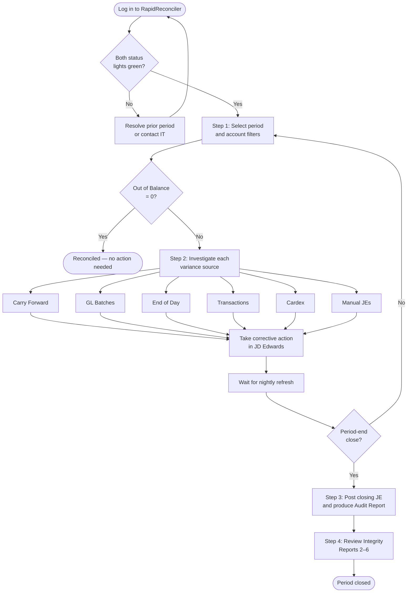

# How To Reconcile Perpetual Inventory in RapidReconciler

A practical, step-by-step guide for reconciling JD Edwards perpetual inventory (F4111) to the general ledger (F0902) using RapidReconciler.

---

## Who This Guide Is For

You should use this guide if you are responsible for closing inventory accounts at period-end, or for monitoring inventory variances during the period. It assumes you have a RapidReconciler login and access to JD Edwards for making corrections.

> **Important:** RapidReconciler is read-only. It identifies what is out of balance and where the discrepancy originates — but every correction is made in JD Edwards, not in RapidReconciler. Data refreshes nightly; transactions entered today won't appear until tomorrow.

---

## The Reconciliation Process at a Glance

### How Often to Run Each Step

| Activity | Frequency |
|---|---|
| Steps 1 and 2 — Monitor and investigate variances | Daily or weekly |
| Steps 3 and 4 — Closing activities and integrity reviews | Period-end only |

---

## Before You Begin

### What You Need

| Item | Requirement |
|---|---|
| **RapidReconciler login** | Provided by your administrator |
| **Browser** | Chrome, Edge, Firefox, or Safari |
| **Network** | Office network or VPN |
| **JD Edwards access** | Required for making corrections |
| **Account permissions** | Confirm with your administrator which companies and accounts you can see |

### Key JD Edwards Tables Behind the Scenes

You won't query these directly, but understanding what RapidReconciler is comparing helps when investigating variances.

| Table | What It Holds |
|---|---|
| F4111 | Item Ledger — every inventory transaction |
| F41021 | Item Location — current on-hand balances |
| F0902 | Account Balances — GL period-end totals |
| F0911 | Account Ledger — GL transaction detail |
| F4095 | Distribution/Manufacturing AAI Values |
| F4101 / F4102 | Item Master / Item Branch |

---

## Step 1: Select the Right Data and Confirm the System Is Ready

### 1.1 Log in and check the status lights

Both status indicators at the top center of the Reconciliation page **must be green** before you make any GL adjustments.

| Light | Green Means | Red Means | What To Do If Red |
|---|---|---|---|
| **Inventory Validation** | Carry-forward from prior period is accurate | Likely an unposted batch in the prior period | Hover for details; resolve the prior period first |
| **System Status** | Last JD Edwards import succeeded | Import error | Hover for details; contact your administrator |

> **Flashing yellow on System Status** means the import is still running. Wait for it to finish before reviewing data.

### 1.2 Select the period and apply filters

- Use the **period selector** in the top-right corner. New periods appear automatically as cardex transactions are entered in JD Edwards.
- Apply filters in left-to-right order: **Company → Business Unit → Object → Subsidiary**. Removing a company also removes its child entities.
- Filter and period selections persist as you move between pages within the inventory module.

> **Tip:** If the screen looks stale or columns don't refresh, click the refresh icon in the top-right corner.

---

## Step 2: Read the Valuation Section, Then Investigate Variances

### 2.1 Check the Valuation section

The Valuation section answers one question: *does perpetual match the GL for this period and these accounts?*

| Field | What It Shows | Source |
|---|---|---|
| **GL Balance** | General ledger total | F0902 — should match your trial balance exactly |
| **Perpetual Balance** | Summarized cardex total | F4111, summarized by RapidReconciler |
| **Out of Balance** | The difference | Zero = fully reconciled |

> **Out of Balance = $0** → Inventory is reconciled. Stop here.
>
> **Out of Balance ≠ $0** → Continue to 2.2 and work through each variance source below.

### 2.2 Work through each variance source

Every non-zero line in the Variance Calculation section needs attention. The sum of these lines equals the total Out of Balance amount.

#### Carry Forward

> The variance from the prior period that wasn't fully cleared.

**Why it happens:** A prior-period variance was left unresolved at close.

**How to fix it:**
- Go back to the prior period and resolve the original issue if possible.
- If the prior period is closed and the amount is immaterial, roll it into this period's manual JE — and document the decision for audit.

#### GL Batches

> GL detail entries (F0911) where the batch hasn't been posted yet.

**Why it happens:** Batches sit unposted because of approval holds, posting errors, or missing batch headers.

**How to fix it:**
- Work with finance to identify and post outstanding batches.
- A **bell icon** on this row flags batches unposted for more than 2 days — treat as urgent.
- For a missing batch header, run the JD Edwards Missing Batch Header report, rebuild the header, and repost.

> **Must be $0 before closing the period.** Don't proceed to Step 3 with this line non-zero.

#### End of Day

> Item ledger records (F4111) that don't yet have a batch number or GL date.

**Why it happens:** Ship confirmations, material issues, and work order completions create item ledger records immediately, but the GL batch isn't created until **Sales Update (R42800)** or **Manufacturing Accounting (R31802A)** runs — usually nightly.

**How to fix it:**
- A **bell icon** flags orders open more than 2 days — investigate why nightly jobs haven't picked them up.
- Confirm Sales Update and Manufacturing Accounting are scheduled and completing.
- Engage IT for chronically stuck orders.

> **Must be $0 before closing the period.**

#### Transactions

> Dollar differences between an item ledger transaction (F4111) and its GL entry (F0911) — where the two don't match on company, account, fiscal period, document type, document number, order number, or batch number.

**Why it happens:** DMAAI misconfiguration, fiscal period mismatches from backdated transactions, intercompany settlements landing in unexpected accounts, and direct ship handling.

**How to fix it:**
- Go to the **Transactions page** (see [Reference: Transactions Page](#reference-the-transactions-page)) and review each row.
- Use the Transaction Detail report (the **+** icon) to find the root cause.
- The corrective action is **always an offsetting manual JE in JD Edwards** — the original transaction is final and can't be rewritten.
- Add a note in RapidReconciler for each resolved item so the audit trail is complete.

#### Cardex

> Items where summarized item ledger (F4111) doesn't match on-hand balance in F41021.

| Variance Type | Meaning | How to Resolve |
|---|---|---|
| **Quantity variance** | F4111 quantity ≠ F41021 quantity | Requires an IT SQL correction — cannot be fixed through normal JDE transactions |
| **Amount variance** | F4111 extended cost ≠ F41021 value | Dollars-only IA adjustment in JD Edwards |

> **How to find them:** Open the **Cardex Integrity pop-up** in RapidReconciler. It lists only items with variances and tells you which type. Always validate against JD Edwards before adjusting.

#### Manual Journal Entries

> Manual entries posted directly to the inventory GL account.

These are surfaced here so they're visible inside the reconciliation. No corrective action — this line confirms manual entries are accounted for in the variance math.

### 2.3 Use the supporting widgets to dig in

These tools sit alongside the variance lines and help you find and resolve issues faster.

| Widget | When To Use It |
|---|---|
| **Drill Down Widget** | Multi-company environments — see which account holds the largest variance. Click sections to drill from currency code through company, business unit, object, and subsidiary. |
| **Out of Balance History Graph** | Shows variance trends across the last 14 periods. Use it to tell whether a variance is recurring or a one-off. Click any data point to jump to that period. |
| **Offset Account Widget (star icon)** | Hover over the End of Day or Transactions row. Opens a pop-up listing the inventory account and suggested offset for each variance, exportable to Excel. *Period-end close tool — mid-period entries won't reflect.* |
| **Journal Entry Button** | Produces an Excel report of GL and perpetual balances for account-level JEs when you don't need transaction-level detail. |

> **About the Offset Account export:** The `je_account` column will include rows for the inventory side, a "Tolerance Adjust" line for sub-unit rounding, and "TBD" placeholders for any variance rows without a configured offset. Replace "Tolerance Adjust" and "TBD" with the correct GL accounts before pasting into JD Edwards.

---

## Step 3: Period-End Closing Activities

Only do this once Step 2 is fully worked through.

### 3.1 Pre-close checklist

Confirm all of the following before posting your closing JE:

- [ ] **GL Batches** variance = $0
- [ ] **End of Day** variance = $0
- [ ] **Transaction** variances reviewed; offsetting JEs prepared
- [ ] **Carry Forward** accounted for in the manual entry (if applicable)

### 3.2 Post the closing journal entry

Choose the right tool based on what you're posting:

| What You're Posting | Tool To Use |
|---|---|
| **Account-level amounts** | Journal Entry button — produces an Excel report of GL and perpetual balances |
| **Transaction-level amounts** | Offset Account widget (star icon) — export to Excel, replace "TBD" with real accounts, paste two rightmost columns into JD Edwards |

After posting, **wait for the next nightly import** and confirm Out of Balance returns to $0.

### 3.3 Produce and save the Audit Report

The Audit Report is your permanent record of the period's reconciliation. **Produce it for every period and save it externally** — detail data may be removed during a future purge.

The report contains:

| Section | What's In It |
|---|---|
| Accounts Summary | Valuation and variance summary for each account |
| Unposted GL Batches | Any remaining unposted batches |
| End of Day | Work orders or sales orders still awaiting processing |
| Manual Journal Entries | All manual entries posted to the account |
| Variances | Transaction variances with your notes |
| Perpetual Details | Item balances and values at period end |

Output: Excel or PDF.

---

## Step 4: Review the Integrity Reports

Integrity reports surface JD Edwards configuration issues that *cause* future variances. Review them at install and then **monthly** at period-end.

### 4.1 The reports you must review monthly

| Report | Name | What It Catches | How to Resolve |
|---|---|---|---|
| **Report 2** | DMAAI Entry Integrity | Business unit/object/subsidiary mismatches and net-zero accounts in DMAAI tables | Correct the AAI entries in JD Edwards |
| **Report 3** | Excluded GL Classes | Items whose GL class isn't in the model DMAAI table 4152 — their values are excluded from the reconciliation | Add the GL class to the model, or confirm exclusion is intentional |
| **Report 4** | UOM Conversion Integrity | Items whose transaction UOM differs from the primary UOM with no conversion factor (causes -9999 in the As-Of quantity column) | Add the direct conversion in JD Edwards |
| **Report 5** | GL Class Integrity | Items where the GL class on F4102 doesn't match one or more F41021 location records | Correct in JD Edwards using the proper GL class change procedure |
| **Report 6** | Frozen Cost Integrity | Items where F30026 frozen cost ≠ F4105 method 07 ledger cost | Re-roll the cost in JD Edwards (equivalent to running R30543) |

> Items clear from these reports automatically after the next nightly refresh once the underlying JDE data is corrected.

### 4.2 Other reports — review when triggered

| Report | When to Review |
|---|---|
| **Report 0 — JDE DMAAs** | Debugging only — when investigating Transactions page items |
| **Report 1 — Model AAI Table** | Before any GL adjustments — confirms DMAAI 4152 is accurate |
| **Report 7 — Duplicate Item Costs** | When alerted at login — causes the import to fail; correct in JDE immediately |
| **Report 8 — Duplicate Sales Integrity** | When items appear — typically caused by Sales Update failures; resolve via cycle count and manual JE; contact rrsupport@getgsi.com for help |
| **Report 9 — Clean Cutoff Integrity** | Informational — items where cardex creation period ≠ GL date period; no action required, review for accrual opportunities |
| **Report 10 — Items Missing Branch Records** | When items appear — severe data integrity issue; contact IT immediately |

---

## Reference Material

The sections below are reference info you'll dip into during Step 2 — they support the workflow rather than being a separate process.

### Reference: The Reconciliation Page Layout

The Reconciliation page is the default page after login. It has four parts you'll use throughout the process:

- **Status indicators** (top center) — both must be green; see Step 1.1.
- **Period selector** (top right) — driven by the reconciliation start date your administrator configured. If more than 14 periods exist, ask your administrator about a purge.
- **Account filters** (left-to-right hierarchy) — Company → Business Unit → Object → Subsidiary. Use the search row at the top of each column to filter within it.
- **Valuation and Variance Calculation sections** — covered in Step 2.

To open the **Inventory Validation Report**, click directly on the Inventory Validation status light. This report is your starting point any time that light is red.

### Reference: The Transactions Page

Use this page when the **Transactions** line in the Variance Calculation is non-zero.

**What's listed:** Documents where F4111 doesn't match F0911. Fully reconciled transactions don't appear.

**Tolerance:** Transactions differing by less than 1 monetary unit are excluded by default, but their amounts still roll up into the Transactions line of the variance. Administrators can change this threshold.

**Filters:**

| Filter | Options |
|---|---|
| Type | Inventory, Sales, Manufacturing, Purchasing |
| Sub Type | Accounts, Periods, Transfers, Intercompany, Direct Ship, Voucher Variance |
| Order Type | JDE order type |
| Document Type | JDE document type |

**Filter widget tips:**
- **Target icon** isolates one value and hides others in that category.
- **Toggle switch** turns a value on/off independently — useful for stacking views (e.g., target Sales, then toggle Inventory back on).

**Subtotals widget** has a **Type** dropdown that groups totals by Type, Sub Type, Order Type, or Document Type.

**Transaction Detail report:** Click the **+** icon at the left of any row to expand. The green icon exports detail to Excel. Six sections:

| Section | What It Shows |
|---|---|
| 1 — Unassigned Account | Cardex transactions whose GL class isn't in the model DMAAI table — stock items belong here |
| 2 — F4111 Cardex | All cardex rows for the selected company, document type, and document number |
| 3 — F0911 GL | All GL rows for the same company, document type, and document number |
| 4 — RapidReconciler | How RR matches and summarizes — one row = match; multiple rows = mismatch |
| 5 — Order Data | All lines for the related sales order or PO; for intercompany, related order info |
| 6 — DMAAIs | All DMAAI entries for each GL class involved; first row is from the model table |

**Analysis tips:**
- Verify company number, account number, and period end date align across Sections 2 and 3.
- For single-sided IT transfers, cardex shows only the "from" side and GL nets to $0.
- Account differences between Sections 2 and 3 → check DMAAI setup in Section 6.

> **Corrective action for every Transactions page item:** offsetting JE in JD Edwards plus a note in RapidReconciler.

### Reference: The As-Of Page

The supporting detail behind the Perpetual Balance shown in the Valuation section. Use it when you need to see balances at the item, branch, location, or lot level.

**Important behavior:**
- Amounts are **summarized F4111 from the balance forward** — not a snapshot of item balance × unit cost.
- Items can have a value with no quantity. This is expected — see the Zero Balance Adjustments guide.
- **-9999** in the Quantity on Hand column means a UOM conversion factor is missing (Integrity Report 4).

**Filters** (combinable, all match from start of value): Item Number, Branch Plant, Location, Lot. The **Totals** row sums all visible rows.

**Detail section controls:**
- **Daily As-Of dropdown** — view inventory as of any single day in the period. Clear it before comparing to the Reconciliation page perpetual total (which uses period end).
- **Common UOM** — restates quantities across items in one UOM for easier analysis (administrator must configure).
- **Summarize by Item** — collapses location and lot detail to branch + item level; nets offsetting positives and negatives.
- **Plus icon** — expands transaction detail for any row; exportable.
- **Row Count** — top right; pagination kicks in above 250 rows.

**Key columns:**

| Column | Meaning |
|---|---|
| CurrCost | Current item cost from the cost ledger; period-independent |
| CalcCost | Amount ÷ Quantity on Hand; zero when quantity is zero |
| QtyVar | F4111 summarized quantity vs. F41021 quantity |
| AmtVar | F4111 summarized extended cost vs. F41021 value |

> **GL class code changes:** Changing a GL class without following the proper procedure produces multiple rows for the same item on the As-Of grid. Correct procedure: (1) adjust inventory to zero under the original code, (2) update the code at all hierarchy levels (item branch, item location, open orders), (3) adjust inventory back in under the new code.

### Reference: The Roll Forward Page

Lists item activity across a date range, with document and order types mapped to report columns by your administrator. **Informational — not part of the standard reconciliation flow.**

**Validation:** Look at the rightmost **Variance** column. Any non-zero value means a document or order type may be missing from the report configuration — ask your administrator to review.

---

## Common Pitfalls and Tips

A few things worth keeping in mind as you work through the process:

- **Never adjust the GL on stale data.** Both status lights must be green and the latest import must be complete. Acting on red or yellow data is how variances get baked in for future periods.
- **Carry-forward rolls.** A small variance left in one period reappears as Carry Forward next period — and compounds. Resolve in the period it originates whenever possible.
- **DMAAI is the usual suspect for Transactions variances.** Before assuming a transaction is broken, check Section 6 of the Transaction Detail report.
- **Cardex variances split two ways.** Quantity variances need IT (SQL); amount variances need a dollars-only IA in JDE. The Cardex Integrity pop-up tells you which.
- **Save Audit Reports externally.** Don't rely on RapidReconciler retaining detail data forever — purges happen.
- **Watch for repeating variances.** The Out of Balance History Graph is the fastest way to tell whether you have a chronic configuration issue or a one-off.

---

## Where to Get More Help

| Topic | Document |
|---|---|
| Login, navigation, first-time setup | Getting Started with RapidReconciler |
| DMAAI tables, GL account assignment, period-end logic | Inventory Key Concepts |
| JDE vs. RapidReconciler reconciliation, timing, backdating | Stock Status and Trial Balance Reconciliation Guide |
| DMAAI model table process and refresh | Managing Inventory Accounts |
| Item ledger balances, posting codes, dates | Working with the Item Ledger |
| DMAAI setup, GL class codes, business unit | Ultimate DMAAI Guide |
| GL class code change procedure | Managing GL Class Codes |
| UOM changes and cardex impact | About Units of Measure |
| Cost methods, cost levels, F4105 | Product Costing Guide |
| Zero balance adjustments | Zero Balance Adjustments |
| Cardex variance — standard vs. average cost | Handling Cardex Variance |
| Sales order types, AAIs, JEs, common issues | Sales Order Reference Guide |
| In Transit module — concepts and use | In Transit Key Concepts / Using the Application |
| PO Receipts module — concepts and use | PO Receipts Key Concepts / Using the Application |
| Companies, users, settings, offset accounts | Administrator Responsibilities |
| Support | rrsupport@getgsi.com |
